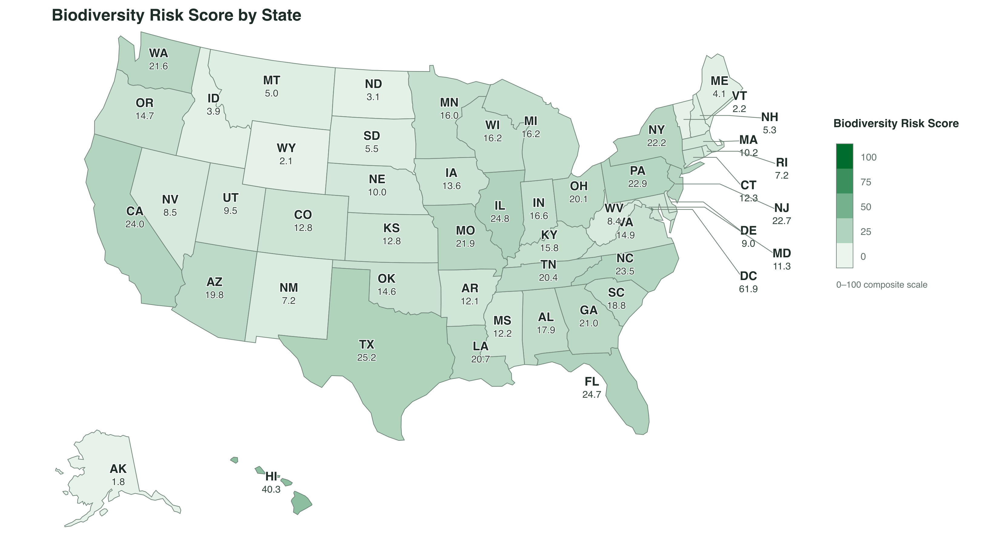
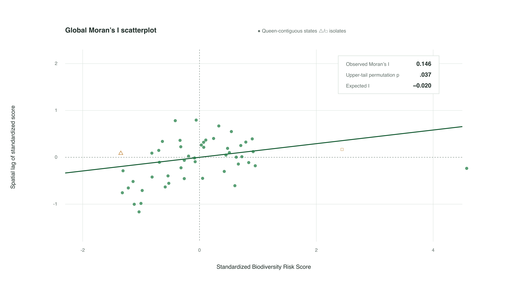
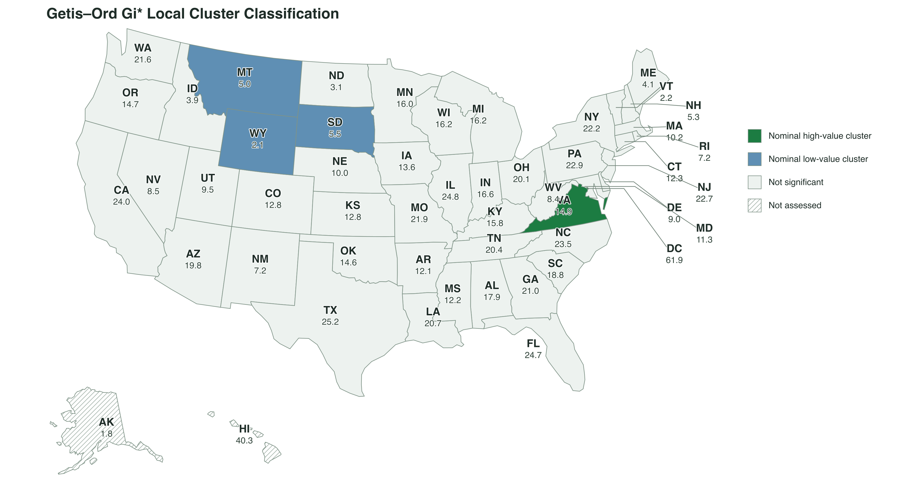
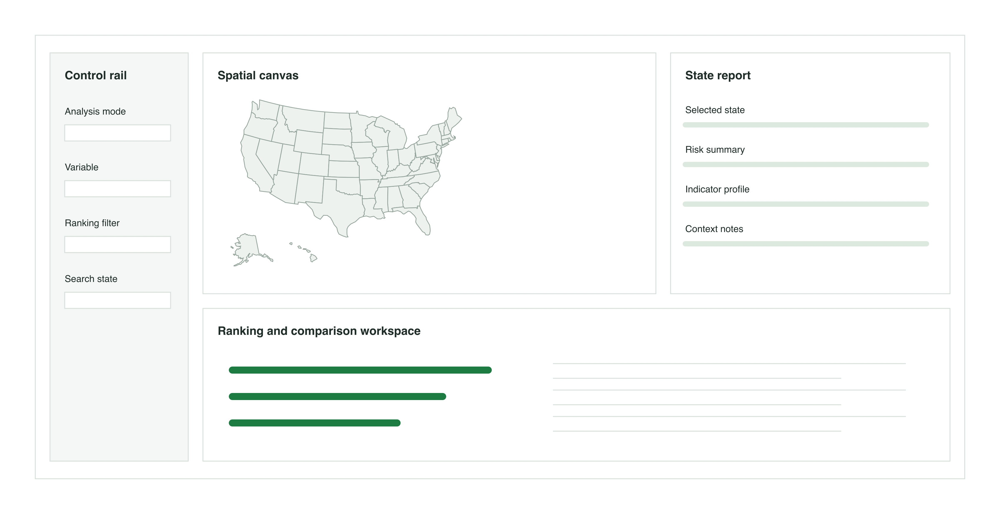
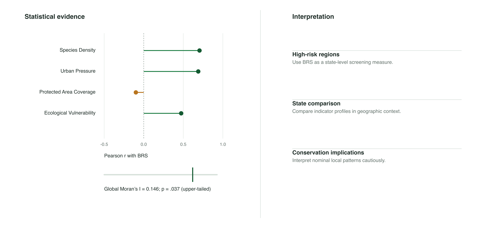

# Introduction

Biodiversity loss has emerged as one of the most critical environmental challenges of the 21st century.
In the United States, despite decades of regulatory frameworks such as the Endangered Species Act (ESA), ecosystems face unprecedented threats from habitat fragmentation, rapid urbanization expansion, and accelerating climate change.
A fundamental challenge in national environmental governance lies in the strategic allocation of limited conservation resources.
Because ecological stress and species vulnerability are unevenly distributed, policymakers often struggle to identify where interventions will yield the highest ecological return.

Traditional conservation prioritizing frequently relies on aggregate metrics, such as raw species richness or total count of threatened species.
However, simple counts fail to reflect true ecological vulnerability because states differ fundamentally in geographic area, protected area coverage, human population pressure, and climatic stress.
For instance, a state with high species diversity but expansive, well-connected protected lands presents a starkly different risk profile than a smaller, densely populated state experiencing rapid land-use conversion.
Evaluating biodiversity risk without accounting for these baseline spatial and anthropogenic variables yields a distorted picture, leading to potentially misdirected conservation funding and reactive policy-making.

To overcome these limitations, this study proposes a state-level spatial-statistical framework designed to objectively quantify biodiversity risk across the United States.
By integrating heterogeneous datasets—including species occurrence, land cover, population density, climate projections, and protected area boundaries—we implement an advanced feature engineering pipeline to normalize multi-dimensional indicators into a unified Biodiversity Risk Score (BRS).
Furthermore, rather than treating states as isolated administrative units, this framework employs spatial statistics, including global Moran's $I$ and Getis--Ord $G_i^*$ hotspot analysis, to detect spatial auto-correlation, identify regional risk clusters, and capture cross-border ecological spillover effects.

To bridge the gap between complex spatial-statistical modeling and practical decision-making, we build a dashboard, which serves as an interactive visual analytics interface that enables users to explore spatial patterns, compare indicators, and examine local risk profiles.

# Data and Feature Engineering

## Data Sources

To construct a comprehensive biodiversity risk assessment framework, this study integrates multi-source geospatial, environmental, socioeconomic, and biodiversity datasets.
All datasets were aggregated at the U.S. state level to enable spatial comparison and statistical analysis.

| Dataset | Description | Category | Source |
|-----------------|---------------------|-----------------|-----------------|
| State Boundary | Administrative boundaries and spatial reference units | Geographic data | U.S. Census Bureau TIGER/Line |
| Protected Area | Spatial distribution and coverage of protected lands | Conservation data | Protected Areas Database of the United States (PAD-US) |
| Endangered Species Data | State-level endangered and threatened species counts | Biodiversity data | U.S. Fish and Wildlife Service (USFWS) ECOS |
| Population and GDP | Demographic and socioeconomic indicators representing human activity intensity | Socioeconomic data | U.S. Census Bureau |
| Natural Hazard Risk | Environmental hazards including wildfire, drought, and flood risks | Environmental data | FEMA National Risk Index |
| Land Cover | Land cover composition including forest, urban, agricultural, and wetland areas | Environmental data | National Land Cover Database (NLCD) |

These datasets represent four major dimensions influencing biodiversity vulnerability:

- **Biodiversity pressure:** endangered species distribution and concentration.
- **Habitat condition:** land cover composition and protected area coverage.
- **Anthropogenic pressure:** population density and urban development intensity.
- **Environmental stress:** climate-related hazards and ecosystem vulnerability.

------------------------------------------------------------------------

## Data Preprocessing

Before spatial analysis and visualization, all datasets were processed through a standardized geospatial preprocessing workflow.

The preprocessing workflow includes:

```{mermaid}
flowchart LR

A["Raw Datasets<br/>Species<br/>Land Cover<br/>Climate<br/>Socioeconomic"]

B["Data Cleaning<br/>Missing value handling<br/>Format standardization"]

C["CRS Standardization<br/>Projection alignment<br/>Area calculation"]

D["Spatial Aggregation<br/>State-level extraction<br/>Zonal statistics"]

E["Normalization<br/>Min-Max scaling"]

F["Feature Engineering<br/>Species Density<br/>Protection Ratio<br/>Human Pressure<br/>Climate Vulnerability"]

G["Final Analytical Dataset<br/>Biodiversity Risk Analysis"]

A --> B --> C --> D --> E --> F --> G

classDef data fill:#E8F3FF,stroke:#3B82F6,stroke-width:2px;
classDef process fill:#EAF7EA,stroke:#22A06B,stroke-width:2px;
classDef output fill:#FFF4E5,stroke:#F59E0B,stroke-width:2px;

class A data;
class B,C,D,E,F process;
class G output;
```


All spatial datasets were transformed into a common projected coordinate reference system to ensure accurate spatial measurements and area calculations.

Raster-based environmental datasets, including land cover information, were summarized within state boundaries using spatial aggregation methods.
Socioeconomic and biodiversity datasets were joined using state identifiers to create a unified state-level analytical dataset.

Because variables were measured using different units and scales, continuous variables were normalized before composite index construction.

The Min-Max normalization method was applied:

$$X'=\frac{X-X_{min}}{X_{max}-X_{min}}$$

where $X'$ represents the normalized value, allowing different indicators to be combined within a common scale.

------------------------------------------------------------------------

## Feature Engineering

Feature engineering transforms heterogeneous ecological, climatic, and anthropogenic variables into a common analytical framework.
Let $x_{ij}$ denote the observed value of feature $j$ for state $i$, where $i = 1, \ldots, n$ and $j = 1, \ldots, m$.
In this study, five core features are considered: Species Diversity (SD), Protected Range (PR), Habitat Pressure (HP), Climate Vulnerability (CV), and Population Density (PD).

Because these variables have different units and scales, each feature is rescaled using Min--Max normalization.
The direction of normalization depends on whether a higher value represents greater or lower biodiversity risk.

For a positive risk indicator, where larger values imply greater risk, the normalized value is defined as

$$z_{ij}^{(+)}
=
\frac{x_{ij} - \min_i(x_{ij})}
{\max_i(x_{ij}) - \min_i(x_{ij})}.$$

For a negative risk indicator, where larger values imply lower risk, the direction is reversed:

$$z_{ij}^{(-)}
=
\frac{\max_i(x_{ij}) - x_{ij}}
{\max_i(x_{ij}) - \min_i(x_{ij})}.$$

The transformed values satisfy $0 \leq z_{ij} \leq 1$, with larger values always indicating greater biodiversity risk.
In the present framework, SD and PR are treated as negative risk indicators because higher species diversity and stronger protection are associated with lower risk.
HP, CV, and PD are treated as positive risk indicators because higher habitat pressure, climatic vulnerability, and population density are associated with greater risk.

To determine feature weights objectively, the Entropy Weight Method (EWM) is applied to the normalized feature matrix.
First, the proportional contribution of state $i$ to feature $j$ is calculated as

$$p_{ij}
=
\frac{z_{ij}}
{\sum_{i=1}^{n} z_{ij}}.$$

The information entropy of feature $j$ is then

$$e_j
=
-k\sum_{i=1}^{n}p_{ij}\ln(p_{ij}),
\qquad
k=\frac{1}{\ln(n)}.$$

For numerical stability, values of $p_{ij}=0$ are assigned a contribution of zero because $\lim_{p\rightarrow 0^+}p\ln(p)=0$.
The degree of diversification is defined as

$$d_j = 1-e_j,$$

and the objective weight of feature $j$ is

$$w_j
=
\frac{d_j}
{\sum_{j=1}^{m}d_j}.$$

Features with greater cross-state variation contain more discriminating information and therefore receive larger weights.
Finally, the Biodiversity Risk Score (BRS) for state $i$ is computed as the weighted sum of its normalized feature values:

$$\mathrm{BRS}_i
=
100\sum_{j=1}^{m}w_j z_{ij}.$$

The resulting score ranges from 0 to 100, where higher values indicate greater relative biodiversity risk.

```{python}
#| label: generate-mock-data
#| code-fold: true
#| echo: true
#| warning: false

import numpy as np
import pandas as pd
from IPython.display import HTML, display

rng = np.random.default_rng(2024)

states = [
    "Alabama", "Alaska", "Arizona", "Arkansas", "California",
    "Colorado", "Connecticut", "Delaware", "Florida", "Georgia",
    "Hawaii", "Idaho", "Illinois", "Indiana", "Iowa", "Kansas",
    "Kentucky", "Louisiana", "Maine", "Maryland", "Massachusetts",
    "Michigan", "Minnesota", "Mississippi", "Missouri", "Montana",
    "Nebraska", "Nevada", "New Hampshire", "New Jersey", "New Mexico",
    "New York", "North Carolina", "North Dakota", "Ohio", "Oklahoma",
    "Oregon", "Pennsylvania", "Rhode Island", "South Carolina",
    "South Dakota", "Tennessee", "Texas", "Utah", "Vermont", "Virginia",
    "Washington", "West Virginia", "Wisconsin", "Wyoming"
]

mock_data = pd.DataFrame({
    "State": states,
    "SD": rng.uniform(0.20, 0.98, size=50),
    "PR": rng.uniform(0.05, 0.95, size=50),
    "HP": rng.uniform(0.10, 0.90, size=50),
    "CV": rng.uniform(0.15, 0.95, size=50),
    "PD": rng.lognormal(mean=4.2, sigma=0.75, size=50)
})
```

The mock dataset represents a reproducible state-level analytical input.
SD, PR, HP, and CV are simulated as bounded indices, whereas PD is generated from a log-normal distribution to reflect the right-skewed distribution commonly observed in population-related variables.

```{python}
#| label: normalize-features
#| code-fold: true
#| echo: true
#| warning: false

feature_directions = {
    "SD": "negative",
    "PR": "negative",
    "HP": "positive",
    "CV": "positive",
    "PD": "positive"
}

features = list(feature_directions.keys())
normalized_data = mock_data.copy()

for feature, direction in feature_directions.items():
    feature_min = mock_data[feature].min()
    feature_max = mock_data[feature].max()
    feature_range = feature_max - feature_min

    if feature_range == 0:
        normalized_data[feature] = 0.0
    elif direction == "positive":
        normalized_data[feature] = (
            (mock_data[feature] - feature_min) / feature_range
        )
    else:
        normalized_data[feature] = (
            (feature_max - mock_data[feature]) / feature_range
        )
```

Following normalization, all five features share the same interpretation: larger values represent greater biodiversity risk.
This directional alignment allows the indicators to be aggregated without introducing contradictory sign conventions.

```{python}
#| label: entropy-weight-method
#| code-fold: true
#| echo: true
#| warning: false

z = normalized_data[features].to_numpy(dtype=float)
n_states = z.shape[0]

# Avoid division by zero if a feature is constant.
column_sums = z.sum(axis=0)
proportions = np.divide(
    z,
    column_sums,
    out=np.zeros_like(z),
    where=column_sums != 0
)

# Entropy calculation with the convention 0 * log(0) = 0.
log_proportions = np.zeros_like(proportions)
positive_mask = proportions > 0
log_proportions[positive_mask] = np.log(proportions[positive_mask])

k = 1 / np.log(n_states)
entropy = -k * np.sum(proportions * log_proportions, axis=0)
diversification = 1 - entropy

# If all observations for a feature are identical, assign equal weights.
if diversification.sum() == 0:
    weights = np.repeat(1 / len(features), len(features))
else:
    weights = diversification / diversification.sum()

weights_table = pd.DataFrame({
    "Feature": features,
    "Direction": [
        feature_directions[feature].capitalize()
        for feature in features
    ],
    "Entropy": entropy,
    "Diversification": diversification,
    "Weight": weights
})
```

Table 1 reports the entropy-based feature weights.
The weights sum to one and are determined entirely by the empirical dispersion of each normalized indicator across states.

```{python}
#| label: table-feature-weights
#| code-fold: true
#| echo: true
#| warning: false

weights_display = weights_table.copy()
weights_display["Entropy"] = weights_display["Entropy"].map(
    lambda value: f"{value:.4f}"
)
weights_display["Diversification"] = weights_display["Diversification"].map(
    lambda value: f"{value:.4f}"
)
weights_display["Weight"] = weights_display["Weight"].map(
    lambda value: f"{value:.4f}"
)

weights_html = weights_display.to_html(
    index=False,
    classes="table table-striped table-hover table-sm",
    border=0,
    justify="center"
)
weights_html = weights_html.replace(
    ">",
    '><caption><strong>Table 1:</strong> Computed Feature Weights</caption>',
    1
)

display(HTML(
    f"""
    <div class="table-responsive">
      {weights_html}
    </div>
    """
))
```

The final BRS is computed by multiplying each normalized feature by its objective entropy weight and summing across features.
Multiplication by 100 provides an interpretable score on a 0--100 scale.

```{python}
#| label: calculate-brs
#| code-fold: true
#| echo: true
#| warning: false

normalized_data["BRS"] = (
    normalized_data[features].to_numpy() @ weights * 100
)

risk_results = (
    normalized_data[["State"] + features + ["BRS"]]
    .sort_values("BRS", ascending=False)
    .reset_index(drop=True)
)

risk_results["Rank"] = risk_results.index + 1
```

Table 2 presents the ten states with the highest computed biodiversity risk scores.
These rankings are illustrative because the underlying values are synthetic; with observed data, the same pipeline can be applied to produce reproducible state-level comparisons.

```{python}
#| label: table-top-risk-states
#| code-fold: true
#| echo: true
#| warning: false

top_10 = risk_results.head(10).copy()
top_10_display = top_10[["Rank", "State", "SD", "PR", "HP", "CV", "PD", "BRS"]]

for column in ["SD", "PR", "HP", "CV", "PD", "BRS"]:
    top_10_display[column] = top_10_display[column].map(
        lambda value: f"{value:.2f}"
    )

top_10_html = top_10_display.to_html(
    index=False,
    classes="table table-striped table-hover table-sm",
    border=0,
    justify="center"
)
top_10_html = top_10_html.replace(
    ">",
    '><caption><strong>Table 2:</strong> Top 10 High Biodiversity Risk States</caption>',
    1
)

display(HTML(
    f"""
    <div class="table-responsive">
      {top_10_html}
    </div>
    """
))
```

```{=html}
<style>
.table-responsive {
  margin: 1rem 0 2rem 0;
}

.table-responsive table {
  width: 100%;
  font-size: 0.92rem;
}

.table-responsive caption {
  caption-side: top;
  text-align: left;
  color: #333;
  padding: 0.5rem 0;
}

.table-caption {
  margin-bottom: 0;
  background: transparent;
}

.table-caption caption {
  caption-side: top;
  text-align: left;
  font-size: 0.95rem;
  padding: 0 0 0.35rem 0;
}

/* Keep only top-level entries visible by default. Quarto's active-link
   behavior expands the current section while scrolling; hover expands the
   corresponding second-level list for quick navigation. */
#TOC > ul > li > ul.collapse {
  display: none;
}

#TOC > ul > li:hover > ul.collapse,
#TOC > ul > li > ul:not(.collapse) {
  display: block;
}
</style>
```

# Spatial Statistical Analysis and Results

The biodiversity indicators and composite Biodiversity Risk Score (BRS)
constructed in the preceding sections provide a common analytical basis for
spatial statistical analysis. This section uses those state-level measures to
examine the geographic distribution of biodiversity risk, identify spatial
clustering patterns, and evaluate associations between risk and selected
ecological, anthropogenic, conservation, and climatic indicators.

The analyses distinguish descriptive spatial association from causal
explanation. A correlation or spatial association is interpreted as evidence of
a statistical relationship in the observed data, not as evidence that one
variable directly produces another.

## Biodiversity Risk Score Construction

The composite BRS is calculated from the directionally aligned and normalized
features using the objective entropy weights obtained above. For state $i$,
the score is defined as

$$
\mathrm{BRS}_i
=
100\sum_{j=1}^{m}w_j z_{ij},
$$

where $z_{ij}$ is the normalized risk-oriented value of feature $j$, and
$w_j$ is the corresponding entropy-derived weight. The score provides a
comparable index of relative biodiversity risk across U.S. states. It should
be interpreted as a composite ranking measure rather than as a direct estimate
of species loss, extinction probability, or ecological damage.

Figure @fig-brs-map displays the final state-level BRS. Scores range from 1.8
to 61.9. The District of Columbia has the highest score (61.9), followed by
Hawaii (40.3); among the 50 states, Texas, Illinois, and Florida are the three
highest-scoring states. These are relative composite-risk rankings, not direct
estimates of species loss or causal effects.

{#fig-brs-map fig-width=10 fig-alt="Albers USA-projected choropleth map of final state-level Biodiversity Risk Scores on a 0–100 composite scale."}

::: {.figure-note}
*Note.* Scores are on a 0–100 composite-risk scale. State abbreviations appear
above their BRS values; small northeastern jurisdictions use leader labels. The
map uses an Albers USA projection and darker green indicates higher relative
biodiversity risk. Source: `research_dataset.csv` (50 U.S. states and the
District of Columbia).
:::

::: {.paper-table}
**Table 3. Top 10 Biodiversity Risk Scores**

| Rank | State | Biodiversity Risk Score |
|---:|:---|---:|
| 1 | District of Columbia | 61.9 |
| 2 | Hawaii | 40.3 |
| 3 | Texas | 25.2 |
| 4 | Illinois | 24.8 |
| 5 | Florida | 24.7 |
| 6 | California | 24.0 |
| 7 | North Carolina | 23.5 |
| 8 | Pennsylvania | 22.9 |
| 9 | New Jersey | 22.7 |
| 10 | New York | 22.2 |

*Table note.* Scores are reported to one decimal place and sorted from highest
to lowest. Values are calculated from the final analytical dataset and therefore
should be interpreted as comparative composite-risk scores.
:::

The observed distribution is concentrated at the lower end of the scale, with a
small number of high-scoring jurisdictions. The District of Columbia and Hawaii
stand apart from the rest of the ranking, while the next eight jurisdictions
form a narrower high-risk group between 22.2 and 25.2. This ranking provides a
transparent baseline for the spatial and correlation analyses that follow.

## Correlation Analysis

Pearson correlation analysis summarizes the direction and strength of linear
association between the Biodiversity Risk Score (BRS) and four focal
indicators: Species Density (SD), Human Pressure (HP), Protection Ratio (PR),
and Climate Vulnerability (CV). All variables are drawn from the final
state-level analytical dataset, so the results refer to associations among 50
U.S. states and the District of Columbia.

For two variables $X$ and $Y$, the Pearson correlation coefficient is

$$
r_{XY}
=
\frac{\sum_{i=1}^{n}(X_i-\bar{X})(Y_i-\bar{Y})}
{\sqrt{\sum_{i=1}^{n}(X_i-\bar{X})^2}
 \sqrt{\sum_{i=1}^{n}(Y_i-\bar{Y})^2}}.
$$

The coefficient ranges from $-1$ to $1$: its sign indicates the direction of
linear association and its absolute magnitude indicates strength. Because the
data are aggregated at the state level ($n = 51$), the results describe
state-level associations rather than individual-level relationships.

For descriptive interpretation, this study classifies thresholds as follows:

* **Strong association**: $|r| \ge 0.70$
* **Moderate association**: $0.40 \le |r| < 0.70$
* **Weak association**: $|r| < 0.40$

These thresholds describe observed linear co-variation and do not imply causal
mechanisms.

{#fig-correlation-heatmap fig-width=10 fig-alt="Lower-triangle 5 by 5 Pearson correlation matrix for Biodiversity Risk Score, Species Density, Human Pressure, Protection Ratio, and Climate Vulnerability."}

::: {.figure-note}
*Note.* The analysis includes 51 state-level units (50 U.S. states and the
District of Columbia). Cells report two-sided Pearson coefficients; \* $p <
.05$, \*\* $p < .01$, and \*\*\* $p < .001$. Source:
`research/results/correlation_results.csv`. Because BRS shares constructed
inputs with several indicators, these correlations are descriptive and should
not be interpreted as independent causal effects.
:::

The empirical results summarize the direction, strength, and statistical
significance of state-level associations between BRS and the four focal
indicators:

* **Species Density (SD)**: Demonstrates a **strong positive association** with BRS ($r = 0.705, p < .001$), indicating that states with greater species concentration correspond to higher overall risk scores.
* **Human Pressure (HP)**: Exhibits a **moderate positive association** with BRS ($r = 0.677, p < .001$). Human Pressure also co-varies strongly with Species Density ($r = 0.686, p < .001$), indicating that these two measures tend to be jointly elevated across states.
* **Climate Vulnerability (CV)**: Displays a **moderate positive association** with BRS ($r = 0.473, p < .001$). Climate Vulnerability has negligible linear associations with the other three indicators ($|r| < 0.08$, $p > .05$), indicating that it contributes a comparatively distinct state-level dimension.
* **Protection Ratio (PR)**: Shows a **weak negative association** with BRS ($r = -0.100, p = .487$). However, this relationship is **not statistically significant**, pointing to a potential spatial disconnect between current state-level protection coverage and high-risk regions.

::: {.paper-table}
**Table 4. Pearson Correlations with Biodiversity Risk Score**

| Indicator | Pearson $r$ with BRS | Sample size | p-value / uncertainty | Interpretation |
|:---|---:|---:|---:|:---|
| Species Density | 0.705 | 51 | < .001 *** | Strong positive association |
| Human Pressure | 0.677 | 51 | < .001 *** | Moderate positive association |
| Protection Ratio (PR) | -0.100 | 51 | .487 (ns) | Weak negative association; not statistically distinguishable from zero |
| Climate Vulnerability (CV) | 0.473 | 51 | < .001 *** | Moderate positive association |

*Table note.* Pearson tests are two-sided. Association strength is classified as
strong when $|r| \ge 0.70$, moderate when $0.40 \le |r| < 0.70$, and weak when
$|r| < 0.40$. Results are based on 51 state-level units (50 U.S. states and
the District of Columbia). Because
BRS incorporates some of these indicators by construction, the correlations
are descriptive rather than evidence of causal effects.
:::

## Spatial Autocorrelation Analysis

Spatial autocorrelation analysis evaluates whether nearby states exhibit more
similar or dissimilar BRS values than would be expected under a spatially
random arrangement. The analysis requires a spatial weights matrix $W$,
which should be defined explicitly in the final implementation—for example,
using state contiguity or a distance-based specification. The selected weights
definition, row-standardization rule, and treatment of isolated spatial units
should be documented because they affect the interpretation of the statistic.

Global Moran's $I$ is calculated as

$$
I
=
\frac{n}{W}
\frac{\sum_{i=1}^{n}\sum_{j=1}^{n}w_{ij}(y_i-\bar{y})(y_j-\bar{y})}
{\sum_{i=1}^{n}(y_i-\bar{y})^2},
$$

where $y_i$ is the BRS for state $i$, $\bar{y}$ is the mean BRS,
$w_{ij}$ is an element of the spatial weights matrix, and
$W=\sum_i\sum_jw_{ij}$. A positive Moran's $I$ indicates that similar
values tend to be located near one another, whereas a negative value indicates
that neighboring areas tend to have dissimilar values.

The final analysis uses row-standardized Queen contiguity weights. The
observed Moran's $I$ of 0.146 is greater than the expected value of -0.020
under spatial randomness. Because environment risk and biodiversity attributes are hypothesized to form positive geographic clusters rather than dispersed checkerboard patterns, a one-sided (upper-tailed) random permutation test ws pre-specified. Based on 9,999 iterations, the test yields $p = .037$, indicating weak but statistically
significant positive spatial autocorrelation at the 5% level(the corresponding two-sided $p = .060$).

::: {.paper-table}
**Table 5. Global Moran's I Results**

| Variable | Spatial weights specification | Observed Moran's $I$ | Expected $I$ | Permutation p-value | Interpretation |
|:---|:---|---:|---:|---:|:---|
| Biodiversity Risk Score | Queen contiguity; row-standardized | 0.146 | -0.020 | .037 (upper-tailed) | Weak positive spatial autocorrelation |

*Table note.* Results use 51 state-level units and 111 undirected Queen-neighbor
links. Alaska and Hawaii have no Queen-contiguous neighbors and therefore have
zero spatial lag. The p-value is based on 9,999 random permutations under the
directional alternative of positive clustering; the corresponding two-sided
permutation p-value is .060.
:::

The Moran scatterplot compares each state's standardized BRS with the
row-standardized spatial lag of its neighbors. The positive trend is consistent
with the global result: states with higher (lower) BRS tend, on average, to be
near states with higher (lower) BRS. The quadrants are descriptive spatial
configurations and do not identify local statistically significant clusters.

{#fig-morans-i fig-width=10 fig-alt="Moran scatterplot of standardized Biodiversity Risk Score and row-standardized Queen-contiguity spatial lag, with Alaska and Hawaii shown as isolates."}

::: {.figure-note}
*Note.* Queen contiguity weights are row-standardized. The plotted statistic is
Global Moran's $I = 0.146$; the upper-tailed permutation p-value is .037 from
9,999 random permutations. Alaska and Hawaii are shown separately because they
have no Queen-contiguous neighbors.
:::

## Hotspot Analysis

Getis--Ord $G_i^*$ analysis is used to identify local concentrations of high
or low BRS values. Whereas global Moran's $I$ summarizes overall spatial
dependence, the $G_i^*$ statistic evaluates whether a state and its specified
neighbors collectively exhibit unusually high or unusually low values relative
to the study area. The subscript $i$ identifies the focal state and the star
denotes that the focal state is included in its own neighborhood sum.

For a value $x_j$ observed at location $j$, the standardized Getis--Ord
statistic can be written as

$$
G_i^*
=
\frac{\sum_{j=1}^{n}w_{ij}x_j-\bar{X}\sum_{j=1}^{n}w_{ij}}
{S\sqrt{\frac{n\sum_{j=1}^{n}w_{ij}^2-
\left(\sum_{j=1}^{n}w_{ij}\right)^2}{n-1}}},
$$

where $\bar{X}$ and $S$ are the mean and standard deviation of the input
variable, and $w_{ij}$ represents the spatial relationship between locations
$i$ and $j$. Positive statistically significant $G_i^*$ values identify
high-value clusters, commonly described as hotspots; negative statistically
significant values identify low-value clusters, commonly described as
coldspots.

The final analysis uses binary Queen-contiguity weights with self-inclusion, as
required for $G_i^*$. Alaska and Hawaii are excluded from the local test because
they have no Queen-contiguous neighbors, leaving 49 contiguous state-level
units. Significance is evaluated with 9,999 random permutations and two-sided
unadjusted pseudo p-values. Benjamini--Hochberg false-discovery-rate (FDR)
adjustment is then applied across the 49 local tests.

{#fig-hotspot-map fig-width=10 fig-alt="Albers-projected U.S. map of nominal Getis--Ord Gi-star hotspot and coldspot classifications for the Biodiversity Risk Score, with Alaska and Hawaii marked as not assessed."}

::: {.figure-note}
*Note.* Map classes use unadjusted two-sided permutation $p < .05$ and are
exploratory. No local $G_i^*$ statistic remains significant after
Benjamini--Hochberg FDR correction ($q > .05$ for all 49 tested units). Alaska
and Hawaii are not assessed because they have no Queen-contiguous neighbors.
State abbreviations appear above their corresponding BRS values; small
northeastern jurisdictions use leader labels.
:::

::: {.paper-table .hotspot-table}
**Table 6. Getis--Ord $G_i^*$ Hotspot Summary**

| Classification | Number of states | State(s) with local statistic | FDR-adjusted inference |
|:---|---:|:---|:---|
| Nominal high-value hotspot | 2 | **District of Columbia** ($G_i^* = 2.592$, $p = .040$)<br>**Virginia** ($G_i^* = 2.072$, $p = .046$) | None remain significant ($q = .416$) |
| Nominal low-value coldspot | 3 | **Montana** ($G_i^* = -2.748$, $p = .015$)<br>**South Dakota** ($G_i^* = -2.161$, $p = .039$)<br>**Wyoming** ($G_i^* = -2.430$, $p = .021$) | None remain significant ($q = .416$) |
| Not significant | 44 | Remaining contiguous states (unadjusted $p \ge .05$) | Not significant |
| Not assessed | 2 | Alaska; Hawaii (no Queen-contiguous neighbors) | Excluded from local test |

*Table note.* Local statistics use binary Queen-contiguity weights with
self-inclusion. Unadjusted two-sided permutation p-values use 9,999 random
permutations (seed = 20260724). FDR values are Benjamini--Hochberg adjusted
across the 49 tested contiguous units.
:::

At the unadjusted level, the District of Columbia and Virginia form nominal
high-value local clusters, while Montana, South Dakota, and Wyoming form
nominal low-value local clusters. However, none of these local results remains
significant after FDR correction. The mapped classes should therefore be read
as exploratory patterns rather than robust evidence of persistent hotspot or
coldspot clusters; sensitivity to alternative weights specifications should be
assessed before making regional policy claims.

# Visualization and Interactive Analysis

The interactive dashboard is the visual companion to the state-level analysis,
not a replacement for the statistical evidence reported above. It uses the same
validated records as the maps, rankings, and state reports in this paper, while
the paper preserves fixed figures, methods, and interpretation boundaries. The
two outputs remain separate portfolio artifacts: this report documents the
analysis, and the [companion dashboard](../index.html){target="_blank"} supports
exploration of the same state-level records.

## Dashboard Design

The dashboard is designed as an interactive visualization system rather than a
second presentation of the paper's results. Its workflow moves from spatial
orientation, to cross-state comparison, to the inspection of a selected state.

{#fig-interactive-framework fig-width=10}

::: {.figure-note}
*Note.* The workflow links a map and legend, a ranked comparison, and a
selected-state indicator view. Diagram elements are schematic rather than
additional data displays; the dashboard uses the same 51 state-level records as
the paper and introduces no new analysis.
:::

## Interactive Workflow

{#fig-overview-comparison-detail fig-width=10}

::: {.figure-note}
*Note.* The interface separates a control rail, spatial canvas, state report,
and ranking-and-comparison workspace. The diagram shows layout and information
coordination only; it intentionally omits specific states and values.
:::

Users select an analysis mode and variable from the control rail, then use the
map and ranking as linked views. A selection made in either view updates the
State Report, while hover labels, search, zoom/reset controls, and ranking
filters support inspection. These controls expose the reported state-level
records; they do not create a new predictive model or change the statistical
interpretation established in the paper.

## Regional Comparative Exploration

{#fig-regional-profile fig-width=10}

::: {.figure-note}
*Note.* Lines compare California, Florida, and Texas across Biodiversity Risk
Score, Human Pressure, Climate Vulnerability, and Protected Area Coverage. Each
axis is min--max normalized within the selected three-state set; Table 7 reports
source-scale values. Protected Area Coverage is shown as coverage, not
reverse-coded risk.
:::

::: {.paper-table .regional-table}
**Table 7. Comparative profiles for California, Florida, and Texas**

| State | Biodiversity Risk Score | Risk Overall | Protected area coverage | Human Pressure | Climate Vulnerability |
|:--|--:|--:|--:|--:|--:|
| California | 24.04 | 100.00 | 23.47% | 4.69 | 60.81 |
| Florida | 24.65 | 96.43 | 16.49% | 6.23 | 55.47 |
| Texas | 25.18 | 98.21 | 2.04% | 2.46 | 62.60 |

*Table note.* Values are reported on their source scales from
`research_dataset.csv`; Protected area coverage is `Protected_Pct`.
:::

The comparison illustrates why linked views are useful. Texas has the highest
BRS of the three (25.18) and the lowest protected-area coverage (2.04%). Florida
has the highest Human Pressure value (6.23), whereas California combines the
maximum Risk Overall value (100.00) with the greatest coverage (23.47%). A user
can select each state in the dashboard, compare its State Report with the
ranking, and apply a risk/protection filter to make these contrasts explicit.

# Discussion

## Key Insights & Policy Implications

{#fig-statistical-synthesis fig-width=10}

::: {.figure-note}
*Note.* The left panel summarizes the focal Pearson results and reported global
Moran's $I$ statistic; the right panel states their intended interpretive use.
Spatial inference is based on the 9,999-permutation and FDR results reported in
Tables 5--6. The figure introduces no new test or policy ranking.
:::

The BRS is best used as a comparative screening measure, not as a direct estimate
of extinction probability or ecological damage. The ranking identifies the
District of Columbia and Hawaii as distinct high-scoring jurisdictions and places
Texas, Illinois, Florida, California, and North Carolina within the next
high-risk group. BRS is strongly associated with Species Density ($r = 0.705$)
and moderately associated with Human Pressure ($r = 0.677$) and Climate
Vulnerability ($r = 0.473$); its association with Protection Ratio is weak and
not statistically distinguishable from zero ($r = -0.100$, $p = .487$). Because
several indicators overlap with BRS construction, these correlations are
descriptive rather than independent causal effects.

Spatial results support comparison but not deterministic hotspot targeting.
Global Moran's $I$ indicates weak positive spatial autocorrelation ($I = 0.146$;
upper-tailed permutation $p = .037$), while the two-sided permutation result is
$p = .060$. Local $G_i^*$ identifies nominal high-value signals in the District
of Columbia and Virginia and nominal low-value signals in Montana, South Dakota,
and Wyoming, but none remains significant after false-discovery-rate adjustment.
The dashboard can therefore help users inspect and compare state profiles, while
the paper provides the context needed to avoid reading a nominal local pattern as
a definitive regional cluster.

## Limitations & Future Work

::: {.paper-table .limitations-table}
**Table 8. Interpretation limits and next analytical steps**

| Analytical issue | Why it matters | Next step |
|:--|:--|:--|
| State-level aggregation | State averages can conceal within-state variation and do not support site-level inference. | Incorporate finer geographic units and time-varying environmental data. |
| Composite-score construction | BRS depends on selected variables, risk direction, and entropy-derived weights; component correlations are not independent effects. | Test alternative feature sets, risk orientations, and weighting schemes. |
| Spatial specification | Results depend on Queen-contiguity weights; Alaska and Hawaii lack Queen-contiguous neighbors. | Compare alternative spatial weights and explicitly report disconnected units. |
| Multiple local tests | Nominal local $G_i^*$ classes do not remain significant after FDR correction. | Treat local patterns as hypotheses and validate them with independent conservation outcomes. |
| Dashboard interpretation | Interactive filtering can make descriptive contrasts appear more definitive than they are. | Expose assumptions, provenance, and sensitivity views alongside each dashboard output. |
:::

The next iteration should preserve the separation of roles established here:
the paper records methods, fixed outputs, and interpretation limits; the
dashboard supports transparent exploration. Together, they provide a portfolio
presentation that remains useful for review without overstating what the
state-level data can establish.
